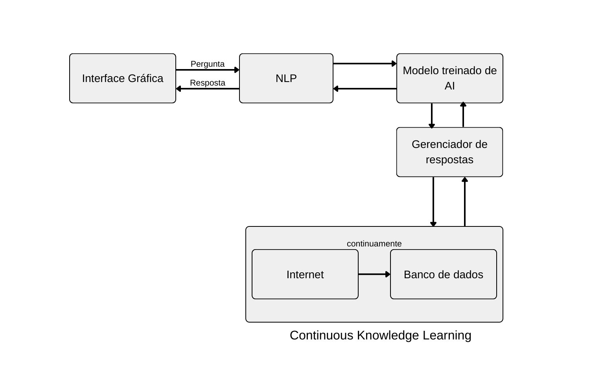

# Atualizando o sistema conversacional: Aprendizado Contínuo em Chatbots.

Priscila F. Santos,2023

## Abstract
Com o passar dos anos é possível ver o crescimento do uso de tecnologias como Chatbot, principalmente em serviços comerciais. Dessa forma, nota-se a importância do investimento tecnológico para aperfeiçoar esse recurso. Além disso, o uso de machine learning constante, reflete também em alguns desafios enfrentados como o de *Concept Drift*, que é a mudança imprevisível nos dados ao longo do tempo. Assim, este artigo visa apresentar como melhorar a performance de chatbots com a implementação de aprendizado contínuo, ou seja, .

## 1 Introdução

O sistema de Chatbot pode ser conceituado como um programa de inteligência artificial e um modelo de interação humano de computador. Usa de Processamento de Linguagem Natural e análise de sentimentos para comunicar-se em linguagem humana.

O aprendizado contínuo se assemelha muito ao processo humano de aprendizado "auto-supervisionado", ou seja, que não requer dados de treinamento anotados / rotulados, aprendidos iterativamente por meio de contato com diferentes humanos [2]. Dentro do universo de chatbots, a aprendizagem iterativa ao decorrer do tempo torna-se essencial para o cumprimento do seu papel. 

Contudo, cabe destacar um dos grandes desafios do avanço e implementação do Aprendizado Contínuo em ML, o chamado *Concept Drift*. Esse descreve mudanças imprevisíveis nos dados ao longo do tempo, o que vai significar que as propriedades estatísticas da variável alvo, que o modelo está tentando prever tomará formas inesperadas [3]. Em consequência disso, a eficiência e acuracidade dos modelos reduzem significativamente. 

## 2 Discussão

Para essa união, diversas propostas já foram feitas dentro da academia. Vale ressaltar o trabalho [4], que estabelece um conjunto de dados e métricas, baseado na exploração de metodologias para a aprendizagem contínua de um LM (language model) em constante mudança, buscando resolver a problemática de Concept Drift.

Assim, o corrente trabalho propõe-se uma arquitetura que incorpora e efetua a prática de aprendizado contínuo em chatbots. Esta abordagem, fundamentada em estruturas convencionais de chatbots [5], contempla uma adaptação no módulo de armazenamento, ou seja, a integração com um sistema de busca avançado e o aprimoramento do banco de dados de referência utilizado pela inteligência artificial da aplicação. Essa iniciativa visa proporcionar uma maior capacidade de aprendizado e adaptação dos chatbots, permitindo que eles forneçam respostas mais precisas e atualizadas aos usuários.

Figura 1 - Arquitetura de chatbot com aprendizado contínuo.
 

Fonte: Elaborado pelo próprio autor (2023).

Conforme a Figura 1, percebe-se inicialmente o módulo da interface gráfica, sendo o primeiro contato do usuário com a aplicação, é onde recebe-se input para o processamento posterior. Caracterizado pelo design de conversa de mensagens usualmente.

 Em seguida, existe a comunicação desse módulo com o grande bloco de NLP que comporta o pré-processamento e o processamento da pergunta (linguagem natural), antes de fazer o envio para a o modelo de machine learning.

Com a pergunta processada, o modelo treinado busca dentro do seu acervo as respostas que melhor atendem ao questionamento feito. Antes dessa busca direta, existe um módulo que faz o gerenciamento dessas queries, permitindo melhor eficiência e velocidade de resposta.

O diferencial dessa arquitetura, está na ligação dos módulos "Banco de dados" e "Internet", que vai caracterizar o aprendizado contínuo. Assim, periodicamente ocorre a introdução e atualização dos dados armazenados no sistema.

## 3 Conclusão

Portanto, conclui-se que a inserção do aprendizado contínuo em chatbots agrega substancialmente a tecnologia, permitindo a atualização de informações dadas em respostas, além de uma interação mais fluída e verossímil entre o usuário e a IA. Cabe destacar, que não se descarta os desafios em relação ao *Concept Drift*, na qual exige um esforço para encontrar soluções a fim de evitar o fenômeno. 

No mais, acredita-se que a implementação do aprendizado contínuo em chatbots é uma tendência que deve ser explorada e aperfeiçoada, visto que a tecnologia está em constante evolução e aprimoramento.

## Referências

[1] Adamopoulou, E., Moussiades, L. Chatbots: History, technology, and applications. **Elsevier**. Greece. 2020.

[2] Chen, Z., Liu, B. Continuous Knowledge Learning in Chatbots. In: Lifelong Machine Learning. **Springer, Cham**. 2018. Capítulo 8. p.131-138.

[3] J. Lu, A. Liu, F. Dong, F. Gu, J. Gama and G. Zhang, "Learning under Concept Drift: A Review". **IEEE Transactions on Knowledge and Data Engineering**. Vol. 31. no. 12. p. 2346-2363

[4]Jang, J. et al. Towards Continual Knowledge Learning of Language Models. **arXiv:2110.03215v4**. 2022.

[5] Tavares, Lucas B. F. Sousa, Ianna M. S. F. A conversational agent architecture for teaching ALgorithms and programming. **Brazilian Journal of Development**. Curitiba, mar. 2021. Vol. 7, no. 3. p. 27472-27482.
