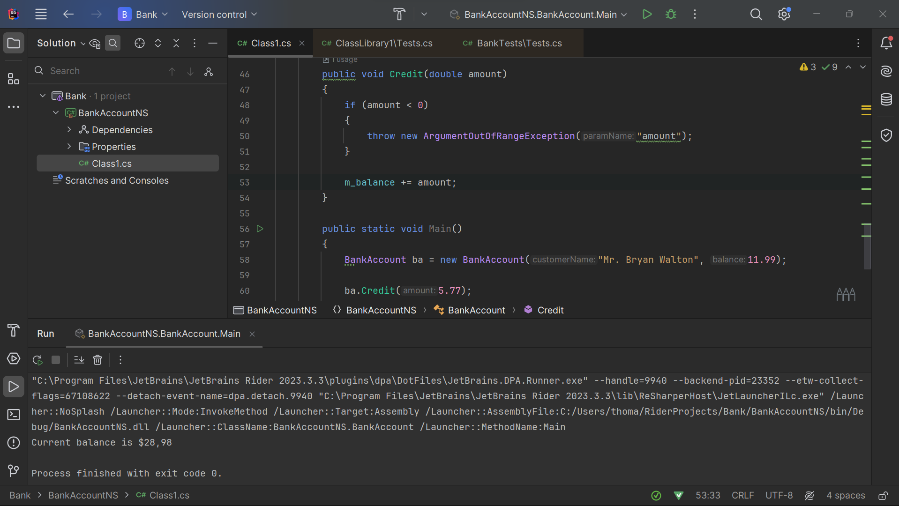
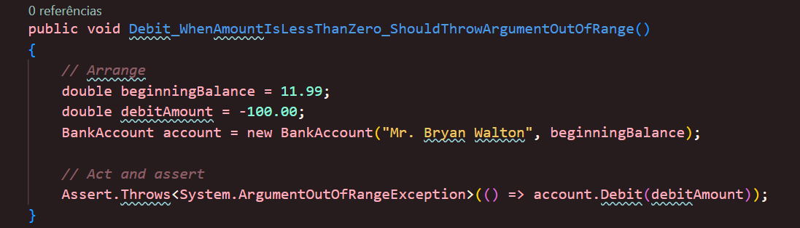
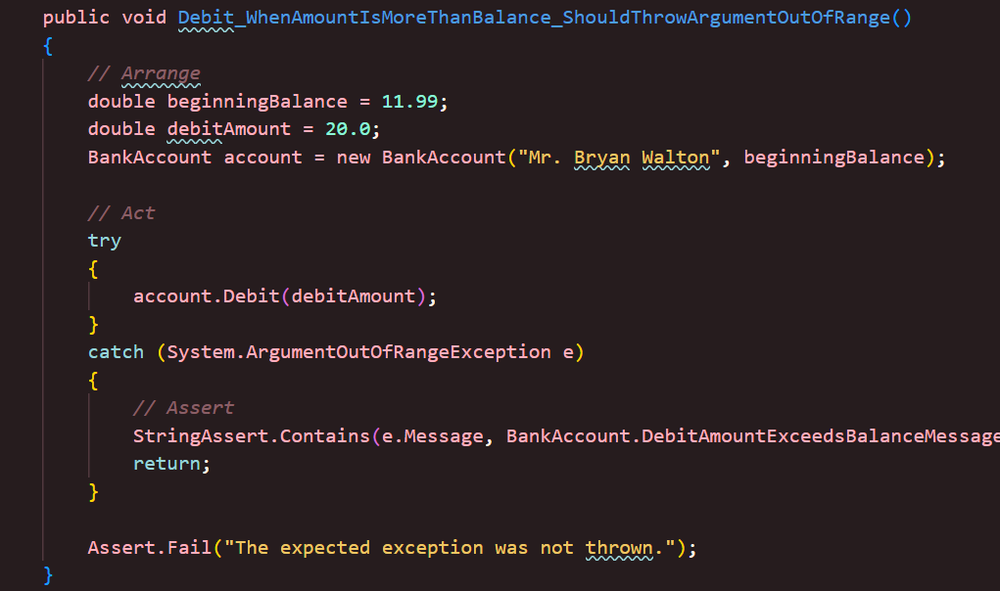

# Atividade Ponderada

Por: Priscila Falcão
<br>
Semana: 3
<br>
Turma: 3
<br>
Ano: 2024
<br>
Prof: Hermano Peixoto de Oliveira Junior


## Questão
Realize o passo a passo do artigo e armazene o seu código em um repositório git. Crie um relatório em markdown com um resumo explicando a tecnologia, os conceitos aprendidos. Adicione prints com o código em execução.

## Testes de unidade
Testes de unidade são uma prática de teste de software em que unidades individuais do programa, como métodos ou classes, são testadas isoladamente para verificar se estão funcionando corretamente conforme sua especificação. Esses testes são escritos pelos desenvolvedores, executados automaticamente e repetidos ao longo do desenvolvimento, ajudando a detectar erros de forma ágil e melhorar a qualidade do código. Eles proporcionam um ambiente controlado para verificar o comportamento das unidades, documentando seu funcionamento e facilitando a manutenção e o trabalho em equipe.

## Atividade
Nesta atividade, foram executados testes de unidade em C#, usando a estrutura de teste de unidade da Microsoft para código gerenciado.

### 1º Passo - Criação de uma classe do programa que iremos testar.

Na metodologia da Microsoft, o primeiro passo em si é a criação do projeto que será testado. Dessa forma, no arquivo <a src= './projeto/Bank/BankAccount.cs'> ```BankAccount.cs``` </a> é definido o programa que será executado e testado.



### 2º Passo - Criação do testes de unidade

Em seguida, há a configuração da classe em que o teste será configurado. Posteriormente são criados os método de teste, na qual são definidos especificamente o que cada um vai testar de funcionalidade.


### 3º Passo - Execução do teste

Para obter os resultados quanto ao programa testado, os testes são executados. Com o retorno obtido, é possível verificar o desempenho do programa.

### 4º Passo - Correção do programa

A partir dos resultados obtidos dos testes, as correções necessárias são feitas no código do programa, para que assim ele seja testado novamente e tenha um melhor desempenho.


## Resultados

### 1º Teste
Seguindo as instruções da metodologia, na primeira execução do teste, foi obtido o resultado:

|Entrada| Valor obtido| Valor Esperado|
|:----:|:---:|:---:|
|11.99|16.54|7.44|

É notável que ocorreu erro ao executar o código - retorno de falha do teste -, uma vez que o ideal é que fosse debitado em conta o valor desejado, contudo foi adicionado. Assim, foi feita uma correção no programa principal, para que a variável ```m_balance``` reduza do total, ao invés de aumentar.

### 2º Teste

Para a nova testagem, um novo método é testado, a fim de abranger novas funcionalidades. Para isso, foi adicionado o método de verificação do comportamento correto quando o valor do débito é menor que zero.



Assim, quando ambos os testes são executados, o primeiro teste passa, uma vez que o código foi corrigido, enquanto o segundo não passa, já que o valor do débito é negativo.

|Teste|Retorno|
|---|---|
|Debit_WithValidAmount_UpdatesBalance|Success|
|Debit_WhenAmountIsLessThanZero_ShouldThrowArgumentOutOfRange| Fail|


### 3º Teste

Em seguida, o tutorial sugere para que um novo teste seja feito, similar ao anterior, contudo diferenciando-se por testar quando o débito ocorre com valor maior do que o em conta.



Assim, o primeiro teste passa, uma vez que corrigido. O segundo falha, uma vez que o valor debitado é menor do que zero, assim como o terceiro teste, que não passa, já que o valor em conta é menor do que o valor debitado.

|Teste|Retorno|
|---|---|
|Debit_WithValidAmount_UpdatesBalance|Success|
|Debit_WhenAmountIsLessThanZero_ShouldThrowArgumentOutOfRange| Fail|
|Debit_WhenAmountIsMoreThanBalance_ShouldThrowArgumentOutOfRange|Fail|

## Refatoração

Por fim, o tutorial nos instrui a refatorar os testes e códigos, para retornos mais explícitos e melhor desempenho.


