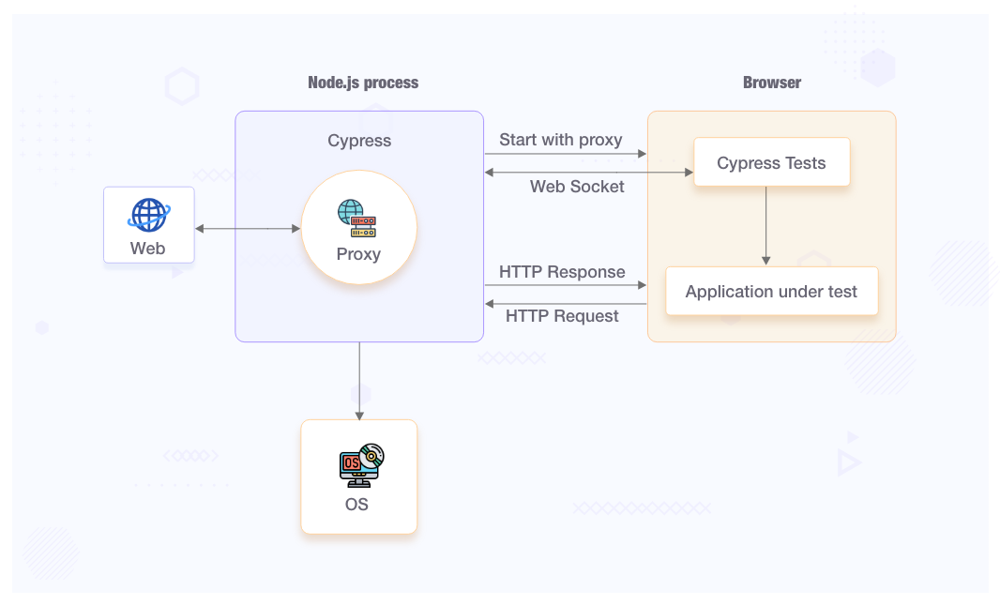

# Atividade ponderada

A partir da documentação oficial do Cypress, prepare um documento de texto contendo as seguintes informações:

1. O que é o Cypress e para que serve?
2. Vantagens e desvantagens do Cypress em relação a outras ferramentas de teste.
3. Arquitetura do Cypress.
4. Seletores de elementos no Cypress.
5. Comandos e asserções no Cypress.
6. Descrição das etapas de preparação de um testes de interface, execução e verificação no Cypress.
7. Como estruturar testes de forma eficiente no Cypress?

O documento deve ser entregue em markdown em um repositório do github.

Não se esqueça de tornar o repositório público ou atribuir acesso aos professores.

Link adicional: https://docs.cypress.io/guides/overview/why-cypress

## 1. O que é o Cypress e para que serve?
O Cypress é uma ferramenta de automação de teste de front-end para aplicativos da web. Ele permite que os desenvolvedores escrevam e execute testes automatizados de forma rápida e fácil em um navegador real.

É conhecido por sua arquitetura única e eficiente, que executa os testes no mesmo loop de eventos do JavaScript do aplicativo testado. Isso significa que o Cypress tem acesso direto e controle total sobre o aplicativo, permitindo a interação com elementos do DOM, simulação de ações do usuário, captura de eventos e verificação de resultados.

## 2. Vantagens e desvantagens do Cypress em relação a outras ferramentas de teste.

**Vantagens do Cypress:**

- Fácil configuração e instalação, com uma curva de aprendizado rápida.
- Execução rápida dos testes devido à sua arquitetura e ao uso do mesmo loop de eventos do aplicativo.
- Interface intuitiva e amigável para escrever, executar e depurar testes.
- Recarregamento automático em tempo real, permitindo a visualização instantânea dos resultados dos testes à medida que são escritos.
- Possui recursos avançados, como o controle total sobre o aplicativo testado, a capacidade de stub e espionar requisições de rede e a gravação de vídeos dos testes executados.

**Desvantagens do Cypress:**
- Não é adequado para testes de carga ou desempenho devido à sua natureza focada em testes de interface do usuário.
- Requer conhecimento em JavaScript para escrever os testes.
- Não se pode usar o Cypress para conduzir dois navegadores ao mesmo tempo.
- Não oferece suporte para várias guias.
- Cypress não oferece suporte para navegadores como Safari e IE no momento.

## 3. Arquitetura do Cypress.

A arquitetura do Cypress é baseada em uma combinação de bibliotecas e ferramentas que trabalham juntas para fornecer uma experiência de teste completa. A arquitetura consiste nos seguintes componentes principais:

- Cypress Test Runner: É a interface gráfica do usuário (GUI) onde os testes são escritos, executados e depurados. Ele fornece um ambiente amigável para interagir com os testes e visualizar os resultados.

- Cypress Server: É o componente central que controla a execução dos testes. Ele intercepta as chamadas de rede do aplicativo testado e permite que os testes controlem o comportamento do aplicativo.

- Browsers: O Cypress usa o navegador Google Chrome para executar os testes. Ele controla uma instância do Chrome em modo headless (sem interface gráfica) para executar os testes de forma automatizada.

- Application Under Test (AUT): É o aplicativo da web que está sendo testado. O Cypress se integra diretamente ao aplicativo e pode controlar e interagir com os elementos do DOM, enviar requisições de rede e executar asserções.

## 4. Seletores de elementos no Cypress.

No Cypress, os seletores de elementos são usados para identificar e interagir com os elementos do DOM durante a execução dos testes. Existem vários tipos de seletores disponíveis:

- seletor por ID: cy.get('#elementId')
- seletor por classe: cy.get('.className')
- seletor por atributo: cy.get('[data-testid="elementId"]')
- seletor por tag: cy.get('input')
- seletor por texto: cy.contains('Texto do elemento')
- seletor por posição: cy.get('li:eq(2)')

Esses são apenas alguns exemplos de seletores que podem ser usados no Cypress. O Cypress também oferece suporte a seletores mais avançados, como seletores CSS e XPath, para casos de uso mais complexos.

## 5. Comandos e asserções no Cypress.

Comandos de interação:

- cy.get(): Seleciona um elemento do DOM com base em um seletor.
- cy.click(): Clica em um elemento.
- cy.type(): Insere texto em um campo de entrada.
- cy.select(): Seleciona uma opção em um elemento de lista suspensa.
- cy.check(): Marca uma caixa de seleção.
- cy.uncheck(): Desmarca uma caixa de seleção.
- cy.clear(): Limpa o conteúdo de um campo de entrada.
- cy.submit(): Submete um formulário.

Comandos de navegação:

- cy.visit(): Visita uma URL específica.
- cy.go(): Navega para frente ou para trás no histórico do navegador.
- cy.reload(): Recarrega a página atual.
- cy.goTo(): Navega para uma página específica no aplicativo.

Comandos de asserção:

- cy.should(): Realiza uma asserção em um elemento selecionado.
- cy.contains(): Procura um elemento contendo um determinado texto.
- cy.expect(): Realiza uma asserção personalizada usando a sintaxe do Mocha.
- cy.assert(): Realiza uma asserção personalizada usando a sintaxe do Chai.
- cy.should('be.visible'): Verifica se um elemento está visível na página.
- cy.should('have.value', 'texto-esperado'): Verifica se um campo de entrada tem um valor específico.

## 6. Descrição das etapas de preparação de um testes de interface, execução e verificação no Cypress.

As etapas básicas para preparar, executar e verificar um teste de interface no Cypress são as seguintes:

**Preparação:**

1) Instale o Cypress em seu projeto usando npm ou yarn.
Crie um arquivo de teste Cypress na estrutura de pastas do projeto.
2) Abra o Cypress Test Runner usando um dos comandos fornecidos.
3) Navegue para o arquivo de teste que você deseja executar.

**Execução:**

4) No Cypress Test Runner, o ambiente de teste será aberto em uma janela do navegador.
5) O Cypress exibirá uma lista de testes disponíveis para execução.
6) Selecione o teste que deseja executar ou execute todos os testes.

**Verificação:**

7) Durante a execução dos testes, o Cypress exibirá a interface do aplicativo testado.
8) O Cypress executará os comandos e asserções definidos no teste.
9) Verifique se os elementos esperados estão presentes, se as ações são realizadas corretamente e se as asserções passam.
10) O Cypress fornecerá informações detalhadas sobre cada etapa do teste, incluindo falhas e mensagens de erro, se houver.

## 7. Como estruturar testes de forma eficiente no Cypress?

Ao estruturar testes de forma eficiente no Cypress, é recomendado seguir algumas práticas:

- **Organize seus testes:** Separe os testes em arquivos e diretórios específicos com base nas funcionalidades ou nos fluxos de trabalho testados. Isso facilita a manutenção e a localização dos testes.

- **Use comandos customizados:** Crie comandos customizados para realizar ações repetitivas ou complexas, como login, preenchimento de formulários ou navegação. Isso ajuda a tornar seus testes mais legíveis e reutilizáveis.

- **Utilize fixtures e mocks:** Use fixtures para carregar dados de teste externos, como arquivos JSON ou CSV. Use mocks para simular respostas de API ou dados de backend. Isso ajuda a isolar o teste do ambiente externo e torna os testes mais confiáveis.

- **Aproveite os recursos de beforeEach e afterEach:** Use os ganchos beforeEach e afterEach para configurar o estado inicial do teste e limpar quaisquer alterações após cada teste. Isso ajuda a manter a consistência e a evitar interferências entre os testes.

- **Priorize a seletividade do seletor:** Use seletores específicos e exclusivos para identificar os elementos do DOM. Evite seletores genéricos que possam causar conflitos ou falhas de teste. Isso ajuda a tornar seus testes mais robustos e menos propensos a quebras.

- **Crie testes independentes:** Certifique-se de que cada teste seja independente e não dependa do estado ou do resultado de outros testes. Isso permite que você execute os testes de forma isolada e identifique problemas com mais facilidade.

## Referências bibliográficas

- https://www.linkedin.com/pulse/diferen%C3%A7as-entre-selenium-e-cypress-anderson-mann/?originalSubdomain=pt
- https://docs.cypress.io/guides/overview/why-cypress
- https://www.infracloud.io/blogs/introduction-cypress-ui-test-automation/