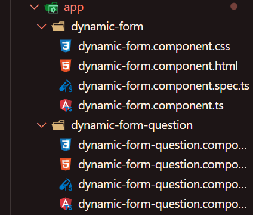

# Atividade ponderada


## Introdução

O tutorial "Dynamic Forms" no site Angular.io fornece um guia claro sobre como criar formulários dinâmicos usando o framework Angular. O tutorial abrange os conceitos fundamentais e práticas recomendadas para lidar com formulários que têm campos dinâmicos, ou seja, campos que podem ser adicionados ou removidos dinamicamente pelo usuário.

## Tecnologias utilizadas

Para essa atividade foi usado unicamente da tecnologia Angular. Angular é um framework de desenvolvimento de aplicativos web de código aberto, mantido pelo Google. Ele é usado para criar aplicativos web de uma única página (Single-Page Applications - SPAs) com recursos avançados e escaláveis. O Angular permite que os desenvolvedores criem aplicativos web dinâmicos e interativos, oferecendo uma estrutura robusta e uma ampla gama de recursos.

## Conceitos aprendidos

O tutorial traz diversos ensinamentos, tanto em relação a tecnologia, como também alguns conceitos.Vale citar: 
- A validação de campos dinâmicos;
- Manipulação de eventos de formulário;
- Como lidar com a submissão do formulário;
Entre outros.

## Projeto executando

Para a execução, é necessário a criação de dois componentes principais, sendo eles ```dynamic-form``` e ```dynamic-form-question```.
</img>

No fim, bastava executar o código para um novo servidor ```ng serve --port 8080 --host 0.0.0.0``` e abrir no navegador o resultado.
</img>