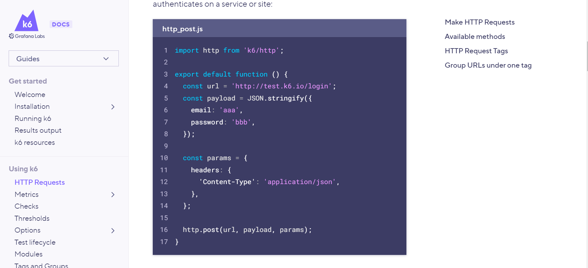

# Atividade ponderada

Escolha um endpoint do seu projeto para realizar o teste.
Realize o passo a passo do artigo e armazene o seu código no repositório git do projeto do seu grupo.
Crie um relatório em markdown com um resumo explicando a tecnologia, os conceitos aprendidos.

Adicione prints com a execução dos testes e os relatórios gerados pela ferramenta.

## Introdução

O link disponibilizado no auto estudo a página fornece informações sobre como utilizar as solicitações HTTP no k6 para realizar testes de carga eficazes e analisar os resultados. É um recurso útil para testadores e desenvolvedores que desejam utilizar o k6 como uma ferramenta de teste de carga.

Fornece descrições sobre algumas funcionalidades e características da 

## Tecnologias utilizadas

O K6 é uma ferramenta de código aberto usada para testar o desempenho e a escalabilidade de aplicativos e serviços da web. É uma ferramenta de teste de carga moderna projetada para ser fácil de usar e capaz de lidar com cenários complexos de teste.

O K6 permite que os desenvolvedores escrevam scripts de teste usando a linguagem JavaScript e simulem várias solicitações HTTP concorrentes para medir o desempenho do sistema. Ele suporta testes de carga distribuída, o que significa que você pode executar testes em vários dispositivos ou servidores em paralelo para simular um grande número de usuários simultâneos.

## Conceitos aprendidos

O tutorial traz diversos ensinamentos, tanto em relação a tecnologia, como também alguns conceitos. Vale citar: 

1. Testes de carga: é uma técnica de teste de software que visa avaliar o desempenho e a capacidade de um sistema sob condições de carga intensa. O objetivo é determinar o comportamento do sistema em termos de tempo de resposta, utilização de recursos, estabilidade e capacidade de lidar com uma grande quantidade de usuários simultâneos ou uma carga de trabalho significativa.

2. Métodos disponíveis da tecnologia K6: O k6 oferece vários métodos para lidar com diferentes tipos de solicitações HTTP, como batch, del, get, head, options, patch, post, put e request. Cada método é explicado em detalhes.

3. Tags de solicitação HTTP: O k6 aplica automaticamente tags às solicitações HTTP, que podem ser usadas para filtrar resultados e organizar a análise. As tags incluem informações como resposta esperada, grupo, nome, método, status e URL.

4. Agrupamento de URLs: Para lidar com URLs dinâmicos e reduzir a quantidade de dados únicos nos resultados, o k6 permite agrupar URLs sob uma única tag. São fornecidos exemplos de como configurar explicitamente uma tag de nome ou usar o envoltório http.url para definir a tag de nome com um valor de modelo de string.

## Projeto executando

Inicialmente foi copiado o backend da aplicação atual que temos no projeto para a pasta atual, a fim de executar o teste especificamente para a ponderada em questão.

Nota-se que para a execução dos testes por meio da tecnologia, foi necessária a instalação

Para o teste foi escolhido o endpoint de upload de arquivo csv, usando uma requisição POST.

Seguiu-se conforme o tutorial de como seria o teste de carga de uma requisição POST, conforme imagem abaixo.



Para adaptar o código para o projeto, o código foi adaptado da seguinte forma:

```
import http from 'k6/http';
import { sleep } from 'k6';

const fileData = open('../src/link-lists/mocked-file/file_model.csv', 'b');

export default function () {
  const data = {
    field: 'this is a standard form field',
    file: http.file(fileData, 'file_model.csv'),
  };
  const res = http.post('http://localhost:3001/link-lists/upload', data);
  sleep(3);
}
```

Assim, com a execução dos testes, conseguiu-se os seguintes resultados:


Para a execução foi considerado o cenário de:

- VUs: 5
- Duração: 10 segundos 