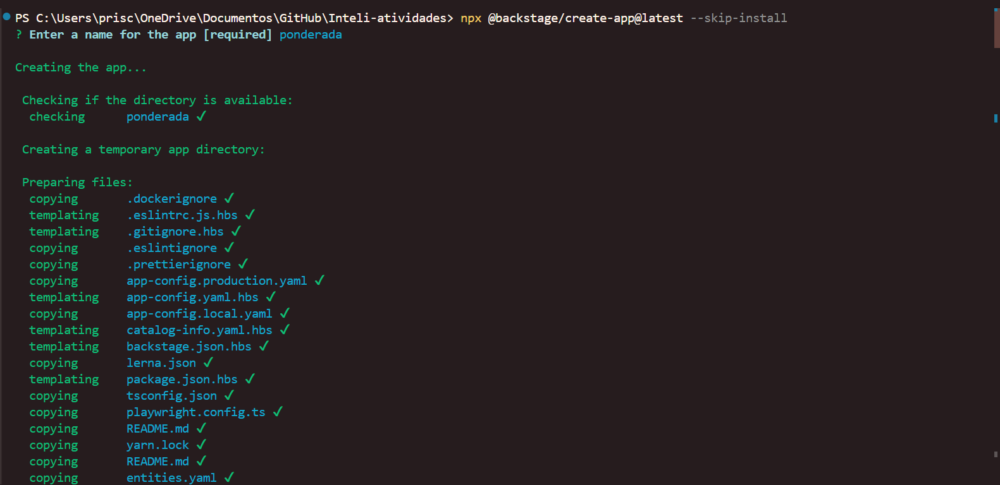
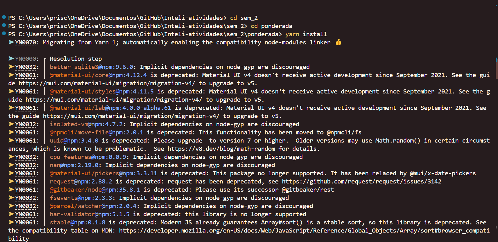
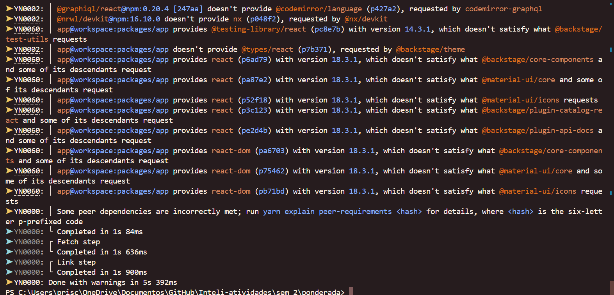
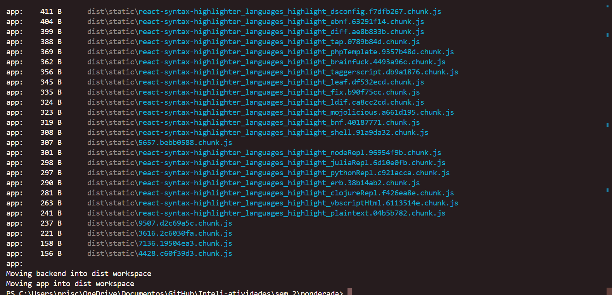
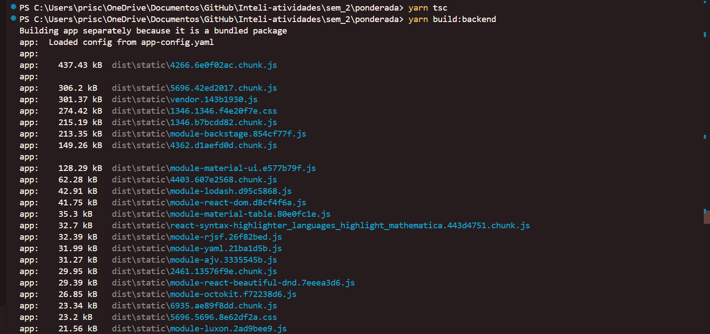

# Ponderada - Enunciado

Siga o passo a passo do artigo, incluindo o link "Building a Docker image" da página principal. Você deverá ser capaz de executar uma instância do Backstage e acessar a funcionalidade de catálogo de serviços conforme a disponível no link de demonstação abaixo:
https://demo.backstage.io/catalog?filters%5Bkind%5D=component e filters%5Buser%5D=all

Documente o processo de compilação e execução da ferramenta e registre em arquivo markdown dedicado à gestão de configuração. Seja claro no passo a passo com instruções que possam ser reproduzidas.

Evidencie o processo por meio de prints que demonstrem a ferramenta em execução.

(De 0 a 4) Documentação do processo de compilação e execução da ferramenta disponibilizada em arquivo markdown dedicado à gestão de configuração.
(De 0 a 3) Clareza na documentação, com passo a passo detalhado e que possibilite a replicação posterior.
(De 0 a 3) Evidência da aplicação sendo executada com prints no arquivo markdown.

# O que é a ferramenta

O backstage.io é um catálogo de software e uma plataforma de desenvolvimento voltada para facilitar a colaboração e o gerenciamento de serviços de software em uma organização. Ele oferece uma abordagem centralizada para descobrir, visualizar e compartilhar informações sobre os serviços de software existentes na organização.

O Backstage foi desenvolvido pelo Spotify e, desde então, foi adotado por várias empresas e comunidades de código aberto. Ele fornece uma interface intuitiva e amigável que permite aos desenvolvedores, operações de TI e equipes de negócios navegarem e interagirem com os serviços de software disponíveis.

A plataforma do Backstage permite registrar e documentar serviços de software, gerenciar dependências, acompanhar métricas, automatizar fluxos de trabalho e fornecer uma visão holística dos serviços de software em uso em toda a organização. Além disso, o Backstage suporta extensibilidade, permitindo que as empresas personalizem e adicionem recursos específicos conforme necessário.

No geral, o backstage.io é uma ferramenta poderosa para melhorar a colaboração e a eficiência no desenvolvimento e gerenciamento de serviços de software, fornecendo uma visão unificada e um ponto central para a descoberta e interação com esses serviços.

# Tutorial

Para realizar a atividade foram seguidos os seguintes passos. 

## Instalar o backstage:
- Rodar o comando ```npx @backstage/create-app@latest --skip-install```.

</img>

- Definir um nome para a aplicação.

- Após criar a aplicação, navegue até a pasta da aplicação e rode o comando ```yarn install```.


</img>

- Caso o seu yarn esteja desatualizado, rodar o comando ```npm install --global yarn```


</img>


## Preparar o build do backstage:

- Rode o comando ```yarn install --frozen-lockfile```


</img>

- Preparar os types com o comando ```yarn tsc```

- Rodar o comando ```yarn build:backend```


</img>

- Ajustar o Dockerfile do backstage:
    - Abra o projeto no vscode
    - Acesse o Dockerfile do backend em ```packages > backend > Dockerfile```
- Substitua tudo pelo código abaixo (retirado do guia de build com docker e ajustado)


```
FROM node:18-bookworm-slim
# Install isolate-vm dependencies, these are needed by the @backstage/plugin-scaffolder-backend.
RUN --mount=type=cache,target=/var/cache/apt,sharing=locked \
    --mount=type=cache,target=/var/lib/apt,sharing=locked \
    apt-get update && \
    apt-get install -y --no-install-recommends python3 g++ build-essential && \
    yarn config set python /usr/bin/python3

# Install sqlite3 dependencies. You can skip this if you don't use sqlite3 in the image,
# in which case you should also move better-sqlite3 to "devDependencies" in package.json.
RUN --mount=type=cache,target=/var/cache/apt,sharing=locked \
    --mount=type=cache,target=/var/lib/apt,sharing=locked \
    apt-get update && \
    apt-get install -y --no-install-recommends libsqlite3-dev

# From here on we use the least-privileged `node` user to run the backend.
USER node

# This should create the app dir as `node`.
# If it is instead created as `root` then the `tar` command below will
# fail: `can't create directory 'packages/': Permission denied`.
# If this occurs, then ensure BuildKit is enabled (`DOCKER_BUILDKIT=1`)
# so the app dir is correctly created as `node`.
WORKDIR /app

# This switches many Node.js dependencies to production mode.
ENV NODE_ENV development

# Copy repo skeleton first, to avoid unnecessary docker cache invalidation.
# The skeleton contains the package.json of each package in the monorepo,
# and along with yarn.lock and the root package.json, that's enough to run yarn install.
COPY --chown=node:node yarn.lock package.json packages/backend/dist/skeleton.tar.gz ./
RUN tar xzf skeleton.tar.gz && rm skeleton.tar.gz

RUN --mount=type=cache,target=/home/node/.cache/yarn,sharing=locked,uid=1000,gid=1000 \
    yarn install --frozen-lockfile --production --network-timeout 300000

# Then copy the rest of the backend bundle, along with any other files we might want.
COPY --chown=node:node packages/backend/dist/bundle.tar.gz app-config*.yaml ./
RUN tar xzf bundle.tar.gz && rm bundle.tar.gz

CMD ["node", "packages/backend", "--config", "app-config.yaml"]
```

## Rodar no docker:

- Rodar o comando ```docker image build . -f packages/backend/Dockerfile --tag backstage --no-cache```  (comando --no-cache para não reutilizar imagens anteriores)
- Executar o container com o comando ```docker run -it -p 7007:7007 backstage```
Após concluir, abrir http://localhost:7007
