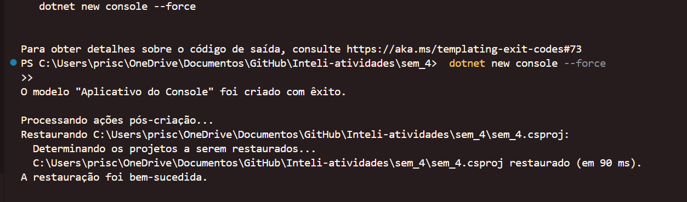
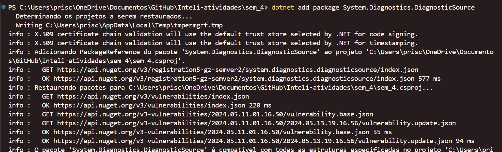
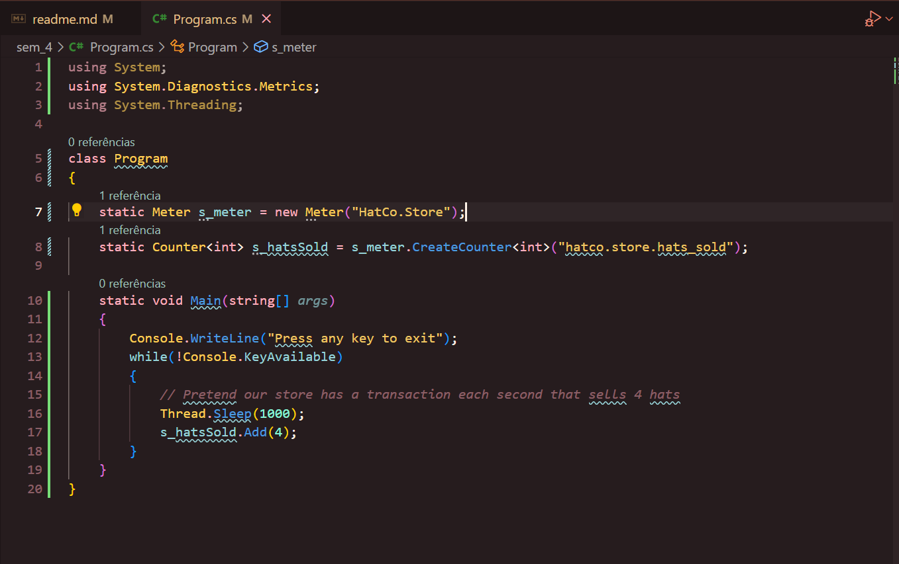
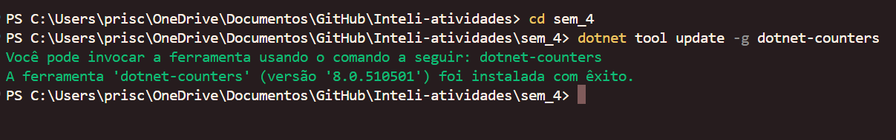
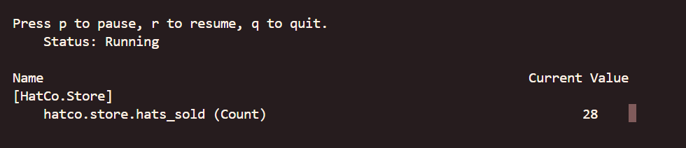

# Ponderada

Realize as atividades propostas no tutorial "Criando métricas". Você deverá criar um repositório no github e implementar todas as etapas. Crie um arquivo markdown e registre, em forma de relatório, o seu avanço. Adicione ao relatório prints da execução do seu programa exibindo as saidas do console/terminal.

Barema:

Codificação de todas as etapas - 3 pontos

Código e Testes compilando e executando sem erros - 3 pontos

Métricas coletadas e evidenciadas no relatório - 2 pontos

Commit semântico e Organização do relatório - 1 ponto

Relatório em markdown escrito de forma clara, concisa e objetiva - 2 pontos.
Instruções:

O artigo da Microsoft é escrito em seções e traz diversos exemplos de métricas, logo, o código do primeiro exemplo vai ser bastante diferente do último exemplo. VOCÊS DEVERÃO FAZER APENAS OS DOIS PRIMEIROS EXEMPLOS:

O primeiro exemplo é a "Criar uma métrica personalizada"

O segundo exemplo é o "Obtenha um Medidor por meio da injeção de dependência"

Para que seja mais fácil compreender, cada um destes exemplos poderia ser um projeto .net separado (dotnet new console).

Sigam a documentação com calma, leiam e compreendam o racional de como construir as métricas.

# Tecnologias usadas

- .NET Core 6 e versões posteriores:
O .NET Core é uma estrutura de software de código aberto e multiplataforma desenvolvida pela Microsoft. Ele foi projetado para permitir o desenvolvimento de aplicativos que podem ser executados em diferentes sistemas operacionais, como Windows, macOS e Linux. O .NET Core 6 é uma versão mais recente do .NET Core e traz várias melhorias e recursos novos em relação às versões anteriores. Ele oferece suporte aprimorado para desenvolvimento de aplicativos da Web, aplicativos de desktop e serviços em nuvem. Além disso, o .NET Core 6 também inclui o ASP.NET Core, um framework popular para construção de aplicativos da web.

- .NET Framework 4.6.1 e versões posteriores:
O .NET Framework é uma plataforma de desenvolvimento de software da Microsoft para construir e executar aplicativos na plataforma Windows. Ele fornece uma ampla biblioteca de classes e recursos para desenvolver aplicativos Windows com recursos como interface gráfica do usuário, acesso a bancos de dados, manipulação de arquivos, comunicação em rede e muito mais. O .NET Framework 4.6.1 é uma versão específica do .NET Framework e versões posteriores se referem a versões mais recentes lançadas após o 4.6.1. Cada nova versão geralmente traz melhorias de desempenho, correções de bugs e recursos adicionais para facilitar o desenvolvimento de aplicativos Windows.

# Conceitos aprendidos

- Criação de métricas personalizadas: O tutorial ensina como criar métricas personalizadas em aplicativos .NET usando as APIs System.Diagnostics.Metrics. Você aprenderá a criar instrumentos de métricas, como contadores, e a registrá-los durante a execução do aplicativo.
- Utilização das APIs de métricas do .NET: O tutorial apresenta as APIs System.Diagnostics.Metrics disponíveis no .NET Core 6 e no .NET Framework 4.6.1 e versões posteriores. Você aprenderá a utilizar essas APIs para criar e registrar métricas relevantes para seus aplicativos e bibliotecas.
- Práticas recomendadas ao criar métricas: O tutorial também aborda práticas recomendadas ao criar métricas em aplicativos .NET. Você aprenderá a armazenar medidores em variáveis estáticas, seguir diretrizes de nomenclatura para instrumentos, considerar o desempenho ao utilizar as APIs de métricas, entre outras boas práticas.
- Exibição e monitoramento de métricas: O tutorial mostra como exibir e monitorar as métricas em tempo real usando a ferramenta dotnet-counters. Você aprenderá a instalar e utilizar essa ferramenta para visualizar as métricas registradas pelo seu aplicativo durante a execução.


# Relatório - Criando métrica personalizada

Este tutorial relata o que a ponderada traz de proposta para o aprendizado dessa semana.

### Passo 1: Pré-requisitos

Antes de começar, certifique-se de ter o SDK do .NET Core 6 instalado em seu ambiente de desenvolvimento. Além disso, verifique se o pacote NuGet System.Diagnostics.DiagnosticSource (versão 8 ou superior) está referenciado em seu projeto.

### Passo 2: Criando uma métrica personalizada

1. Crie um novo aplicativo de console do .NET usando o seguinte comando:
   ```
   dotnet new console
   ```

</img>


2. Adicione o pacote NuGet System.Diagnostics.DiagnosticSource ao seu projeto usando o seguinte comando:
   ```
   dotnet add package System.Diagnostics.DiagnosticSource
   ```


3. Abra o arquivo Program.cs e substitua seu conteúdo pelo seguinte código:
   ```csharp
   using System;
   using System.Diagnostics.Metrics;
   using System.Threading;

   class Program
   {
       static Meter s_meter = new Meter("HatCo.Store");
       static Counter<int> s_hatsSold = s_meter.CreateCounter<int>("hatco.store.hats_sold");

       static void Main(string[] args)
       {
           Console.WriteLine("Press any key to exit");
           while (!Console.KeyAvailable)
           {
               // Pretend our store has a transaction each second that sells 4 hats
               Thread.Sleep(1000);
               s_hatsSold.Add(4);
           }
       }
   }
   ```



### Passo 3: Executando o aplicativo

1. Execute o aplicativo usando o seguinte comando:
   ```
   dotnet run
   ```

2. Deixe o aplicativo em execução por enquanto.

### Passo 4: Práticas recomendadas

O tutorial também fornece algumas práticas recomendadas ao criar métricas em aplicativos .NET. Algumas delas incluem:

- Criar o medidor uma vez e armazená-lo em uma variável estática.
- Seguir diretrizes de nomenclatura para os instrumentos.
- Lembrar que as APIs de instrumento são thread-safe.
- Cuidar do desempenho ao usar as APIs de instrumento.

### Passo 5: Exibindo as métricas

O tutorial mostra como exibir as métricas usando a ferramenta `dotnet-counters`. Para exibir as métricas do aplicativo em execução, siga estas etapas:

1. Certifique-se de ter a ferramenta `dotnet-counters` instalada. Você pode instalá-la usando o seguinte comando:
   ```
   dotnet tool update -g dotnet-counters
   ```



2. Com a ferramenta instalada, execute o seguinte comando para monitorar o contador do aplicativo:
   ```
   dotnet-counters monitor -n metric-demo.exe --counters HatCo.Store
   ```

3. A ferramenta exibirá as métricas em tempo real, mostrando a contagem de chapéus vendidos por segundo.



Esse é um resumo do tutorial. Para obter todos os detalhes e exemplos de código, consulte o [artigo original](https://learn.microsoft.com/pt-br/dotnet/core/diagnostics/metrics-instrumentation).


# Relatório - Obtenha um Medidor por meio da injeção de dependência
