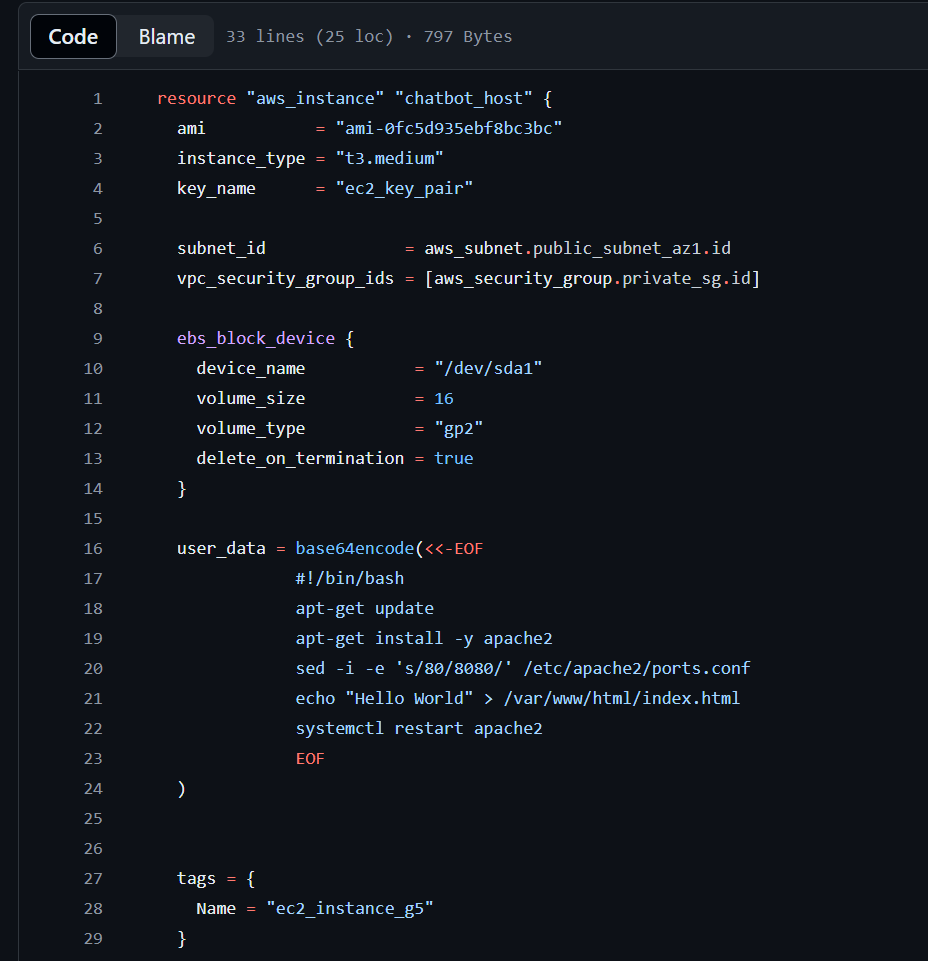

# Ponderada semana 5

Leia o artigo proposto no autoestudo e redija um texto técnico abordando os seguintes temas:
TEMA 1 - A importância de CI/CD no desenvolvimento de software e como ele melhora a eficiência dos times de desenvolvimento.

TEMA 2 - A estrutura e os componentes principais de um workflow do GitHub Actions.

TEMA 3 - A função e a importância do AWS CloudFormation na automação da infraestrutura. Anexe e explique o template que você está usando no seu projeto para criar a instância EC2.

TEMA 4 - Discuta como a integração de GitHub Actions com AWS CloudFormation e Amazon EC2 pode ser aplicada em projetos reais. Quais desafios você encontrou no seu projeto e como os solucionou?

## Tema 1 - A importância de CI/CD no desenvolvimento de software e como ele melhora a eficiência dos times de desenvolvimento.

A implementação de CI/CD (Continuous Integration/Continuous Deployment) no desenvolvimento de software é fundamental para garantir a agilidade, qualidade e confiabilidade dos projetos. CI/CD automatiza a integração e a entrega de código, permitindo que desenvolvedores integrem suas alterações de forma contínua e frequente. Isso reduz significativamente os problemas de integração e facilita a detecção precoce de bugs, já que cada commit é automaticamente testado antes de ser incorporado à base de código principal. Além disso, a automação do processo de deployment assegura que novas funcionalidades e correções de bugs sejam disponibilizadas aos usuários de maneira rápida e segura, sem a necessidade de intervenções manuais que podem ser propensas a erros.

Essa abordagem traz uma série de benefícios para a eficiência dos times de desenvolvimento. Em primeiro lugar, a automação de tarefas repetitivas permite os desenvolvedores se concentrarem em atividades mais estratégicas e criativas, como a criação de novas funcionalidades e a melhoria da experiência do usuário. Além disso, a capacidade de lançar atualizações frequentes e incrementais permite um feedback mais rápido dos usuários, facilitando um ciclo de desenvolvimento mais ágil e iterativo que se alinha melhor com as necessidades do mercado e dos clientes.

## Tema 2 - A estrutura e os componentes principais de um workflow do GitHub Actions.

Inicialmente, cabe destacar o que é o GitHub Actions. Esse trata-se de uma plataforma de automação de fluxos de trabalho (workflow automation) integrada ao GitHub, que permite a criação, gerenciamento e execução de pipelines CI/CD diretamente nos repositórios de código. 

Utilizando um sistema de YAML para definir workflows, os desenvolvedores podem configurar uma série de jobs e steps que desencadeiam ações específicas em resposta a eventos do repositório, como push, pull requests e releases. GitHub Actions facilita a execução de testes automatizados, builds, deploys, e outras tarefas de DevOps. Além disso, a plataforma oferece integração nativa com o ecossistema GitHub.

Componentes principais:
- Workflows: Processos automatizados que você define no seu repositório GitHub.
- Events: Gatilhos que iniciam um workflow (ex: push, pull request).
- Jobs: Conjunto de passos que são executados como parte de um workflow.
- Steps: Tarefas individuais que podem executar comandos ou ações.
- É possível criar as suas próprias ações ou usar ações criadas pela comunidade de GitHub.
- Actions: Comandos reutilizáveis que são partes dos steps.
- Runners: Servidores onde os workflows são executados. É possível usar um runner hospedado no GitHub ou hospedado por você mesmo.
- Imagem: Diagrama mostrando a relação entre esses componentes.

## Tema 3 - A função e a importância do AWS CloudFormation na automação da infraestrutura. Anexe e explique o template que você está usando no seu projeto para criar a instância EC2.

AWS CloudFormation desempenha um papel crucial na automação da infraestrutura ao fornecer uma maneira eficiente e estruturada de gerenciar recursos na nuvem. Utilizando templates em formato JSON ou YAML, CloudFormation permite definir toda a infraestrutura como código (IaC), facilitando a criação, atualização e exclusão de recursos de maneira coordenada e reproduzível. Isso elimina a necessidade de configuração manual, reduzindo o risco de erros humanos e garantindo consistência em diferentes ambientes, como desenvolvimento, teste e produção. 

A capacidade de reutilizar templates também acelera o processo de implantação, permitindo que as equipes de desenvolvimento se concentrem em inovar e entregar valor ao negócio mais rapidamente.

Dentro da nossa aplicação não estamos usando o CloudFormation e sim o Terraform, que é uma ferramenta de infraestrutura como código (IaC) que permite aos usuários definir, provisionar e gerenciar a infraestrutura de TI em diferentes provedores de nuvem de maneira automatizada e declarativa.

A configuração que estamos usando é similar a da imagem abaixo.

</img>

O código funciona da seguinte forma:

- **resource "aws_instance" "chatbot_host"**:
  - Define um recurso `aws_instance` chamado `chatbot_host`.

- **ami**:
    - ID da imagem da máquina Amazon (AMI) a ser usada: `ami-0fc5d935ebf8bc3bc`.

- **instance_type**:
  - Tipo da instância EC2: `t3.medium`.

- **key_name**:
  - Nome do par de chaves SSH para acessar a instância: `ec2_key_pair`.

- **subnet_id**:
  - ID da sub-rede onde a instância será lançada: `aws_subnet.public_subnet_az1.id`.

- **vpc_security_group_ids**:
  - Lista de IDs dos grupos de segurança da VPC: `[aws_security_group.private_sg.id]`.

- **ebs_block_device**:
  - Configuração do dispositivo de bloco EBS:
    - **device_name**: Nome do dispositivo: `/dev/sda1`.
    - **volume_size**: Tamanho do volume em GiB: `16`.
    - **volume_type**: Tipo do volume: `gp2`.
    - **delete_on_termination**: Indica se o volume deve ser excluído na terminação da instância: `true`.

- **user_data**:
  - Script de inicialização base64-encoded:
    - Atualiza os pacotes do sistema.
    - Instala o servidor web Apache.
    - Modifica a configuração do Apache para usar a porta 8080 em vez da porta 80.
    - Cria uma página web simples com a mensagem "Hello World".
    - Reinicia o serviço Apache.

## TEMA 4 - Discuta como a integração de GitHub Actions com AWS CloudFormation e Amazon EC2 pode ser aplicada em projetos reais.

Em projetos reais, essa integração pode ser aplicada de várias maneiras. Por exemplo, ao trabalhar em um aplicativo web, os desenvolvedores podem configurar um pipeline CI/CD usando GitHub Actions que dispara um workflow sempre que o código é alterado. Esse workflow pode incluir etapas para testar o código, construir o artefato da aplicação e, em seguida, usar AWS CloudFormation para provisionar ou atualizar a infraestrutura necessária no AWS. Após a criação ou atualização dos recursos, GitHub Actions pode implementar a aplicação nas instâncias EC2 provisionadas, garantindo que a nova versão esteja disponível para os usuários com mínima intervenção manual. Isso não só melhora a velocidade e a frequência de deploys, mas também garante que a infraestrutura esteja sempre em um estado conhecido e consistente, reduzindo os riscos de falhas e melhorando a confiabilidade do sistema.