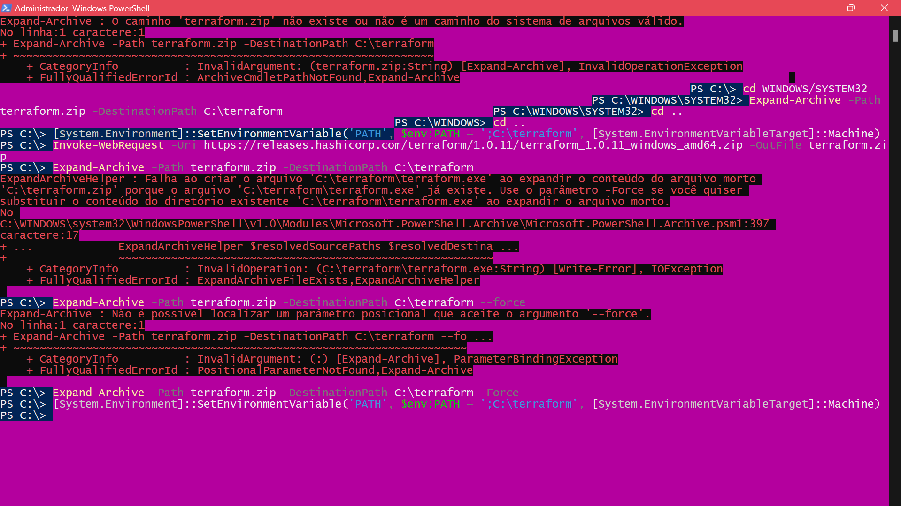
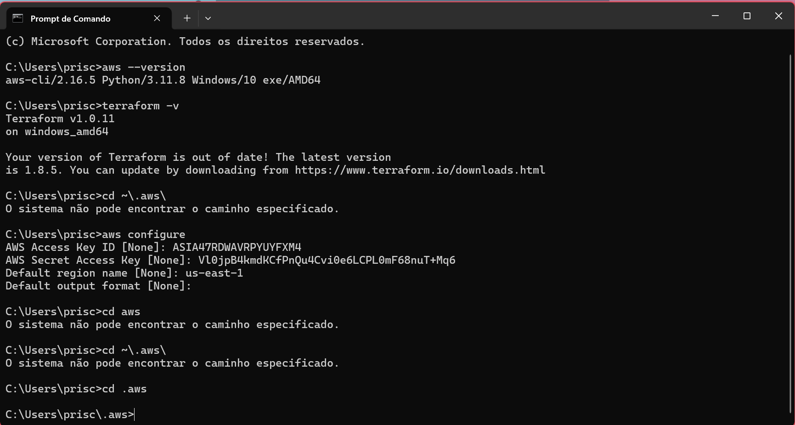
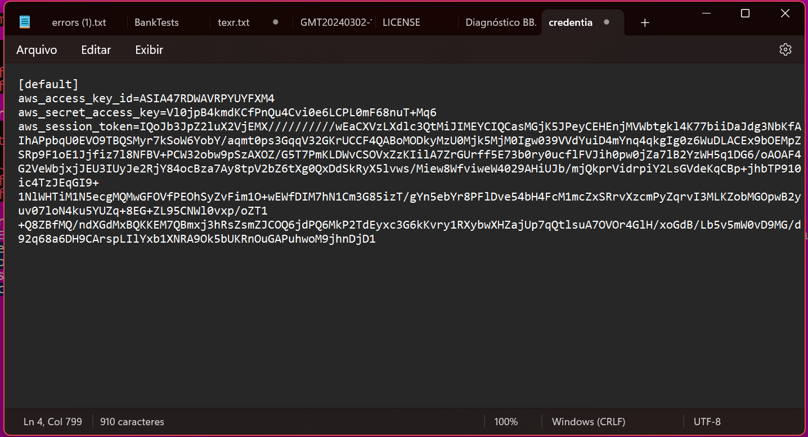
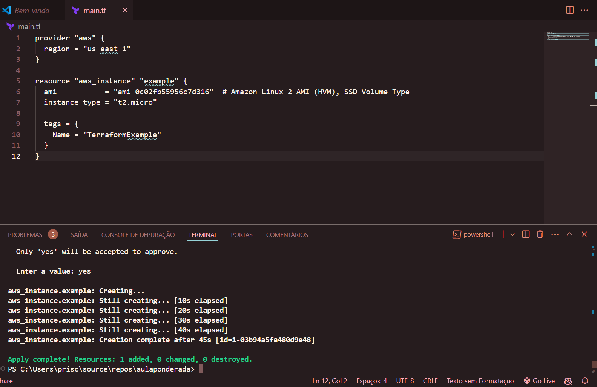
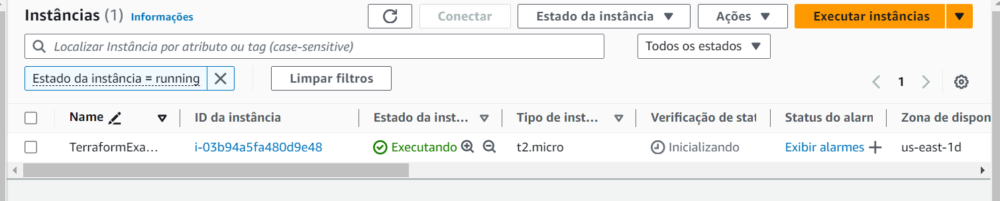
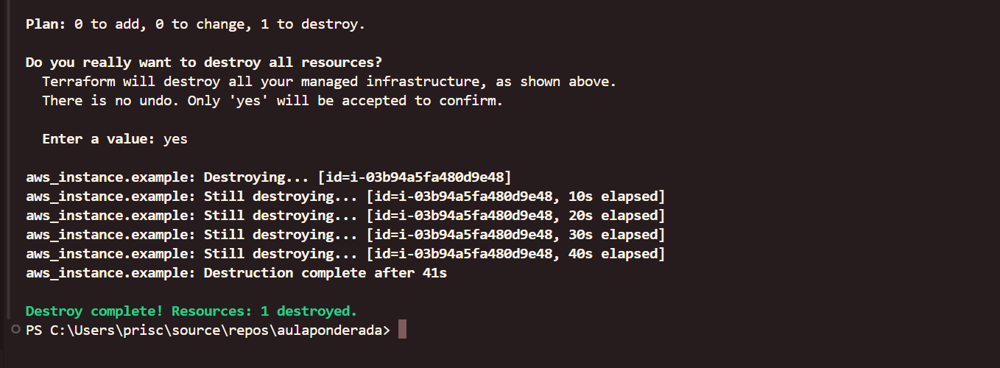
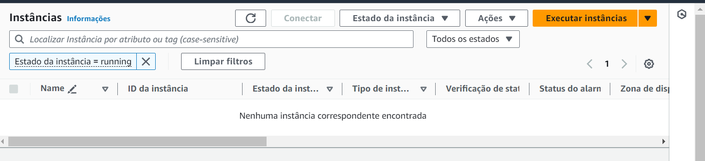

# Ponderada

Conforme tutorial feito em sala de aula, este documento tem o objetivo de relatar os resultados obtidos da prática. Nota-se que todo o trabalho foi feito acompanhado de instruções do professor.

# Conceitos

A automatização da construção de infraestrutura em nuvem é essencial para agilizar e tornar mais confiável o processo de provisionamento e gerenciamento de recursos. Ao utilizar ferramentas como o Terraform, as equipes de desenvolvimento e operações podem definir a infraestrutura de forma declarativa, em vez de executar manualmente uma série de tarefas repetitivas. Essa abordagem traz diversos benefícios, como a redução de erros humanos, a padronização dos ambientes, a facilitação da documentação e a agilidade na implantação de novos recursos. Além disso, a automatização permite que as equipes se concentrem em tarefas mais estratégicas, melhorando a eficiência geral do desenvolvimento e da operação de sistemas em nuvem.

## Terraform

Terraform é uma ferramenta de infraestrutura como código (IaC) open-source desenvolvida pela Hashicorp. Ela permite que os desenvolvedores e equipes de operações definam, provisionem e gerenciem a infraestrutura de nuvem de uma maneira declarativa e automatizada. O Terraform utiliza sua própria linguagem de configuração, HCL (Hashicorp Configuration Language), que é fácil de ler e escrever, e suporta uma ampla gama de provedores de nuvem, permitindo que você gerencie a infraestrutura em múltiplas plataformas.

O Terraform mantém um estado da infraestrutura, permitindo que você visualize, planeje e execute mudanças de forma segura e eficiente. Ele também permite a criação de módulos reutilizáveis, facilitando a organização e a manutenção do código. Além disso, o Terraform fornece um plano de execução antes da aplicação das mudanças, permitindo visualizar o que será criado, atualizado ou destruído, e suas operações são idempotentes, o que significa que você pode executá-las várias vezes sem alterar o resultado final.

## AWS

AWS é a plataforma de computação em nuvem mais abrangente e amplamente adotada do mundo, oferecendo mais de 200 serviços para uma ampla variedade de aplicativos. Lançada em 2006, a AWS se tornou a líder do mercado de nuvem pública, fornecendo uma infraestrutura escalável, confiável e segura para empresas de todos os tamanhos, desde startups até grandes corporações. A AWS permite que os clientes acessem uma gama de serviços, desde computação, armazenamento e banco de dados até inteligência artificial, machine learning e muito mais, tudo isso de forma ágil e com pagamento apenas pelos recursos utilizados.

O EC2 (Elastic Compute Cloud) é um dos serviços mais importantes da AWS, pois fornece capacidade de computação escalável na nuvem. Com o EC2, os usuários podem provisionar e gerenciar facilmente instâncias de máquinas virtuais (VMs) com diferentes configurações de hardware, sistemas operacionais e software pré-instalado. Isso permite que as equipes de desenvolvimento e operações implantem rapidamente novos ambientes, escalem recursos conforme a demanda, e otimizem a utilização da infraestrutura.

# Prática

1) Primeiro foi necessária a instalação do Terraform CLI.

2) Em seguida, é feito a configuração do CLI da AWS.

3) Depois, configuramos as credenciais da AWS, a partir do arquivo txt.

4) Enfim, configuramos o arquivo tf para subir uma EC2 automaticamente configurado.

5) Logo depois, é possível observar o EC2 configurado na interface da AWS.

6) Para destruir a instância criada e manter limpo o ambiente de trabalho, ocorreu conforme a imagem abaixo.

7) Por fim, foi possível verificar na interface da AWS que a instância criada, não estava mais lá.
